  

 

  

 

  
  &nbsp;&nbsp;
  
  &nbsp;&nbsp;
  

 

### 📱 About Me

I am a software developer building smooth, fast, and beautiful mobile applications. 

* 🚀 **Focus:** Creating highly scalable mobile apps using **Flutter** and **Dart**.
* 🛠️ **Architecture:** I write clean code using **Clean Architecture**, **SOLID principles**, and **Bloc/Cubit**.
* 💻 **Environment:** I develop and test my projects on **Linux**.

 

### 📂 Featured Projects

#### 🔹 [Page.ui](https://github.com/page-ui/Page.ui_Frontend-Part)
`Flutter` `GraphQL` `WebSocket` `Docker`
* AI-powered web application built to generate dynamic user interfaces through AI-driven chat. Designed with accuracy for creative professionals and developers, it bridges the gap between natural language prompts and functional UI components.
* Implemented a responsive Flutter web application using Clean Architecture and BLoC/Cubit, with GraphQL queries for API communication and WebSockets for handling real-time AI responses. Implemented secure authentication using JWT tokens, media uploads via URLs, and live HTML iframe previews for the generated interfaces.

#### 🔹 [PageBridge](https://github.com/Polymath000/PageBridge)
`Flutter` `Notion-API` `OAuth2`
* A Flutter application that helps users quickly capture ideas and save them directly to their Notion workspace by selecting a database and creating pages through a property-aware form.
* Developed the Flutter application using Clean Architecture, Cubit/Bloc, and GetIt, with Notion OAuth authentication and secure token management. Implemented paginated database search and a schema-driven form system that dynamically maps Notion properties to input fields, including relations, multi-select, status, dates, and rich text.

#### 🔹 [InsightMed](https://github.com/Polymath000/InsightMed)
`Flutter` `Rest-API` `MVVM`
* A mobile application integrated with the Notion API using OAuth, featuring dynamic form generation and paginated search to streamline database management and data entry. InsightMed is a Flutter mobile app that streamlines the patient and clinician workflow around appointments, clinical notes, and AI-assisted chest X-ray reviews. It integrates image submission with vitals and symptoms, then surfaces AI status, confidence, and summary insights to support clinical review.
* Implemented role-based authentication and navigation, REST API integration with Dio, BLoC-based state management, and secure session persistence. Built multipart file upload handling, structured request and response models, asynchronous API flows, and state management for AI analysis results and clinician review data.

 

### 🛠️ Languages & Tools

 

  
    
  
    
  

 

### 🐍 Contribution Graph

 

  

 

  
Made with ❤️ by <b>Abdelrahman Khaled</b>

  

